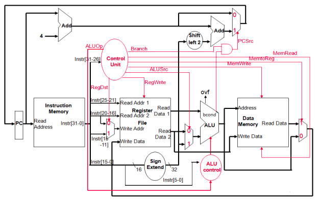

# Project Description

Design of 32bits MIPS Pipelined processor using VHDL and verification using UVM in System Verilog.

The Design phase is divided into two sub projects:
- [One Cycle Processor](##Design-of-a-One-Cycle-MIPS-Processor)
- [Pipelined Processor](#Design-of-a-Pipelined-MIPS-Processor)

## Design of a One Cycle MIPS Processor
The goal of this project was to design a 32-bit processor using the MIPS architecture. In this design, each instruction goes through five stages – IF, ID, EX, DM, and WB – and is completed in one cycle.

The processor is capable of handling various simple instructions from the MIPS Instruction Set Architecture (ISA), such as ADD, SUB, AND, ADDI, BRANCH, LOAD, STORE, and JUMP.

To build this processor, we used structural modeling in VHDL, using different components (that we designed) like the Program Counter, Instruction Memory (IM), Register File (RF), Control Unit, ALU Control, Arithmetic Logic Unit (ALU), Data Memory (DM), Multiplexers, Sign Extend Unit, and Adders.

## Design of a Pipelined MIPS Processor
This is the continuation of the one cycle MIPS processor project, We’re using pipelining to improve the performance of the processor by increasing its throughput and decreasing the execution time of programs in our processor. 

### Pipelining Approach:
We divided the instruction process into stages using D flip flops. This made each instruction take 5 cycles, but it also significantly reduced the time it takes for each cycle. In the end, our processor can now execute one instruction in each cycle, making it about 5 times faster than before.

During the design of the pipelined processor, we encountered some challenges that fall into the following categories:

#### 1. Resources Contention:
This issue typically arises with memory and the register file. However, since we designed separate data and instruction memories (following the Harvard architecture), we managed to avoid this problem. To address any contention in the register file, we modified it to enable writing on the rising edge and reading on the falling edge of the clock.

#### 2. Data Dependency:
Data dependency occurs when an instruction in the pipeline requires the result of a previous instruction that is still in the pipeline. We tackled this by introducing forwarding units, resolving dependencies for R-type instructions. However, a challenge persists with load instructions preceding an instruction that uses their read data, necessitating a stall in the processor. To overcome this, we implemented a hazard unit in the ID stage.

#### 3. Control Dependency:
Control dependency surfaces in cases involving **Jump** or **Branch** instructions.

**Jump Instructions:**
For jump instructions, we flash the subsequent instruction using a mechanism based on a multiplexer in the instruction fetch (IF) stage.

**Branch Instructions:**
- Initially, we inserted no-operation instructions (nops) after the branch instruction in the software to prevent the execution of subsequent instructions until the branch decision was resolved. To optimize this, we moved the branch logic from the data memory (DM) stage to the IF stage, reducing the number of nops from 3 to 1.

- To further enhance efficiency, we introduced a flash mechanism. In the case of a taken branch (Rs=Rt), the flash mechanism immediately replaces the instruction after the branch with a nop without the need for inserting nops in the software.

- Finally, we implemented a Branch Target Buffer (BTB) and a predictor in the IF stage to store the target address of branch instructions. 
the prediction works so that if a branch is once taken, it always gonna be taken.

# Testing and Verification
- While working on the design, we visually checked each part of the processor and the entire processor itself. We mainly used Quartus University Waveform Functional Simulation and ModelSim Simulation for this manual visual verification.

- Currently, we haven't added the UVM verification to this repository yet.

Here are some tests we ran after finishing the pipelined processor to make sure everything is working as expected:

### R type without dependencies:

The following instructions were executed on the processor: 

	"00000001101101010100000000100000"  --add $t0,$t5,$s5
	"00000001101101010100000000100010", --sub $t0,$t5,$s5
	"00000001101101010100000000100100", --and $t0,$t5,$

Simulating on modelsim(they are excuted many times), we obtained the following waveforms:
    

### R type with RF dependency:
The following instructions were executed on the processor: 

	"00000001101101010100000000100000",    -- add $t0,$t5,$s5
	"00000001101101010100100000100010",    -- sub $t1,$t5,$s5
	"00000001101101010101000000100000",    -- add $t2,$t5,$s5
	"00000001000101010101100000100100",    -- and $t3,$t0,$s5
	"00000001000101010100000000100000",    -- add $t0,$t0,$s5
	
Simulating on modelsim, we obtained the following waveforms:
	

### R type with RAW dependencies: forwarding from MEM and WB to EXE stage
The following instructions were executed on the processor: 

		--"00000001101101010100000000100000",    -- add $t0,$t5,$s5
		--"00000001000101010100100000100010",    -- sub $t1,$t0,$s5
		--"00000001101010000101000000100000",    -- add $t2,$t5,$t0
		--"00000001000101010101100000100100",    -- and $t3,$t0,$s5

Simulating on modelsim, we obtained the following waveforms:
	

### I,J type instructions without dependencies:
The following instructions were executed on the processor: 

	"10001100101010000000000000000000",     -- LW $t0, 0($R5)
	"00000000000000000000000000000000",     -- NOP
	"00100001000010000000000000000001",     -- addi $t0,$t0,1
	"10101100101010000000000000000000",     -- SW $t0, 0($R5)
	"00100000101001011111111111111111",     -- addi $R5,$R5,-1
	"00010000000001010000000000000010",     -- beq $zero, $R5, +2
	"00001000000000000000000000000000",     -- jump 0

 Simulating on modelsim, we obtained the following waveforms:
	

## Difficulties Encountered:

1. **Data Memory**: The data memory component was defined as a synchronous RAM, presenting limitations in manipulating it and getting the read data after writing it to the memory. To address this, we introduced a Reset signal, enabling its synthesis as registers. While this solution may not be the most optimal for memory management, it allowed us to progress.

2. **Forwarding Unit**: A specific challenge arose when handling sw instructions with dependencies between the last and the next instructions. We observed incorrect forwarding behavior in such cases. Solution: we introduced an additional condition that checks if the destination register (RD) is the same in the EX/MEM and MEM/WB stages, but with different regwrite values (0 in EX/MEM and 1 in MEM/WB).

3. **Register File**: The Register File faced a constraint where it couldn't read and write simultaneously. To overcome this challenge, we adapted the design from registers to latches by modifying the clock condition from `rising_edge(Clock)` to `(Clock = '0')`.

4. **multiplexer**: refused to work with a process statement, they give undefined outputs when implimented using a behavioral implimentation, however after changing the MUXs to a datapath implimentation everything worked as expected, we have yet to figure out what caused this. specially since it worked fine during the testing phase in Quartus university waveform functional simulation. 

[Rtype-without-dependecies]: ./statics/Waveforms/R%20type%20instructions%20without%20dependencies.pdf
